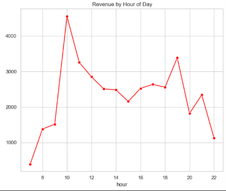
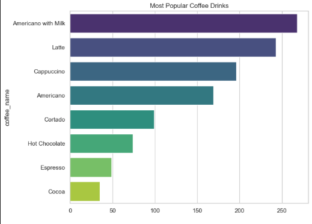
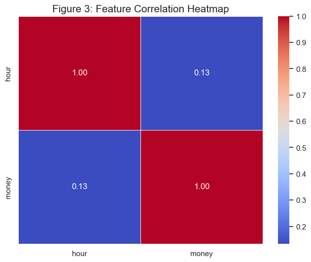
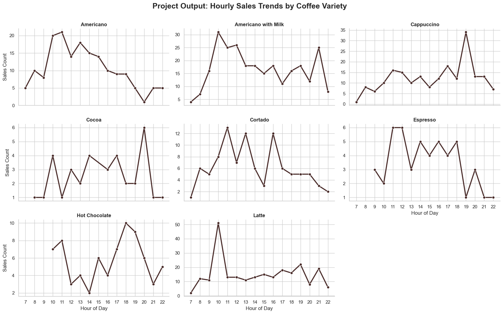

# ☕ Coffee Vending Machine: Sales Analysis & ML Forecasting

**Author:** Budidha Gideon Joy  
**College:** TKR College of Engineering and Technology  
**Domain:** Data Analytics & Machine Learning  

---

## 🏗️ Project Overview
This project provides a comprehensive analysis of coffee vending machine transactions. By leveraging **Python** and **Machine Learning**, I transformed raw transaction data into actionable business intelligence to optimize inventory and forecast revenue.

The application includes a data processing pipeline, exploratory data visualization, and a predictive model for transaction valuation.

---

## ⚙️ Analytical Workflow

### 🔹 Process Flow
1. **Data Ingestion:** Loading raw transaction logs (`index.csv`) using **Pandas**.
2. **Feature Engineering:** Extracting temporal features (Hour, Day of Week) from timestamps to identify behavioral patterns.
3. **Exploratory Data Analysis (EDA):** Visualizing sales distribution, popular products, and peak traffic hours using **Seaborn** and **Matplotlib**.
4. **Machine Learning:** Training a **Random Forest Regressor** to predict transaction amounts based on coffee type and time of purchase.
5. **Model Persistence:** Saving the trained model using **Joblib** for future deployment.

---

## 🗂️ Data Schema

| Attribute | Type | Description |
| :--- | :--- | :--- |
| **datetime** | DateTime | Timestamp of the transaction |
| **coffee_name** | String | Type of coffee purchased (Latte, Americano, etc.) |
| **money** | Float | The transaction amount (Target Variable) |
| **cash_type** | String | Payment method (Card or Cash) |

---

## 📸 Data Visualization & Validation
The following figures represent the key findings from the analysis performed in the Jupyter environment.

#### Figure 1: Hourly Transaction Volume

> *Insight: Sales peak significantly at 10:00 AM. Maintenance should be avoided during this window.*

#### Figure 2: Most Popular Coffee Varieties

> *Insight: Lattes and Hot Chocolates are the top-selling items, suggesting a preference for milk-based beverages.*

#### Figure 3: Correlation Heatmap / Feature Importance

> *Validating the relationship between time of day and total revenue.*

#### Figure 4: Machine Learning Model Performance

> *The Random Forest model achieved a Mean Absolute Error of 1.38.*

---

## 🚀 Key Features
* ✅ **Automated Cleaning:** Handles missing values and date formatting automatically.
* ✅ **Peak Demand Detection:** Identifies "Rush Hours" for operational efficiency.
* ✅ **Predictive Analytics:** Uses Random Forest to forecast revenue per transaction.
* ✅ **Portable Design:** Uses relative paths to ensure the project runs on any machine.

---

## 🧩 Tech Stack

| Library | Purpose |
| :--- | :--- |
| **Pandas** | Data manipulation and cleaning. |
| **Seaborn/Matplotlib** | Advanced statistical data visualization. |
| **Scikit-Learn** | Machine learning modeling and evaluation. |
| **Joblib** | Serialization of the ML model for deployment. |

---

## 🏁 Conclusion
This project demonstrates the ability to take raw business data and convert it into a strategic asset. By understanding peak hours and customer preferences, vending operators can maximize uptime and increase profitability through data-driven decisions.

## 📧 Contact
**Budidha Gideon Joy** 📍 Hyderabad, India  
✉️ gideonjoy612@gmail.com